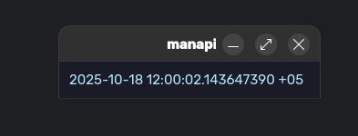

# Qt Extension For ManapiHttp

Qt6 and Qt7 Extern Event Loop for [ManapiHttp](https://github.com/xiadnoring/manapi-http) (based on libuv)

Required [ManapiHttp](https://github.com/xiadnoring/manapi-http) version is ```1.0.2```

> [!WARNING]
> Qt6.10 does not work because they broke
> their Event Dispatcher API

### Import

This is a **header-only library**.
But for a better experience, you should compile it in a separate file.
For example, include and compile it in ```event_dispatcher.cpp ```
and provide a small API for connecting in ```event_dispatcher.hpp``` instead of  unnecessary structures and classes in ```ManapiQt.hpp``` to ```main.cpp``` 

### Example

```c++
#include <manapihttp/ManapiInitTools.hpp>
#include <manapihttp/ManapiEventLoop.hpp>
#include <manapihttp/ManapiTime.hpp>
#include <manapihttp/std/ManapiScopePtr.hpp>

#include <QApplication>
#include <QWidget>
#include <QLabel>
#include <QVBoxLayout>

#include "ManapiQt.hpp"

int main(int argc, char *argv[]) {
    manapi::init_tools::log_trace_init(manapi::debug::LOG_TRACE_HIGH);

    auto ctx = manapi::async::context::create(0).unwrap();

    ctx->run ([&] (const std::function<void()>& cb) -> void {
        auto event_dispatcher = manapi::qt::event_dispatcher::create().unwrap();
        QCoreApplication::setEventDispatcher(event_dispatcher);

        QApplication app (argc, argv);
        QWidget window;

        manapi::scope_ptr vbox (new QVBoxLayout);
        manapi::scope_ptr label (new QLabel);

        vbox->addWidget(label.release());

        window.setLayout(vbox.release());
        window.show();

        manapi::async::current()->eventloop()->custom_event_loop([&app, event_dispatcher] ()
            -> void {
            /* event loop run here */
            QApplication::exec();
            event_dispatcher->unsubscribe();
        });

        manapi::async::current()->timerpool()->append_interval_sync(200,
            [label = label.get()] (const manapi::timer &) -> void {
            label->setText(QString::fromStdString(std::format("{:}", 
                manapi::time::current_time())));
        });

        /* custom event loop run here */
        cb ();
    } /* event loop run here too */ );

    return 0;
}
```

### Gallery


